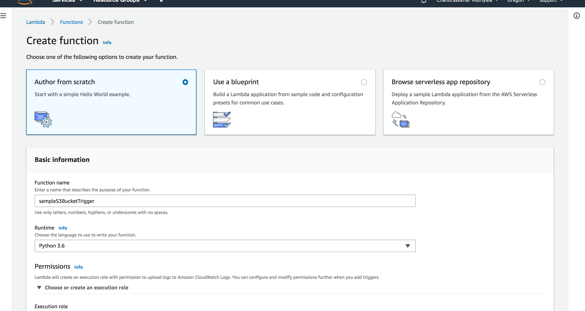

# file-upload-to-s3-save-in-redshift


In this tutorial I will explain how to upload a CSV file into S3 bucket, trigger lambda function extract the CSV file from S3 and copy all the unique values in Apache Redshift cluster.

I will split this tutorial into three sections:

* Setting up permissions for S3 bucket.
* Uploading a CSV file into AWS S3 bucket using Node.js.
* Lambda function: processing the CSV file and storing it onto Redshift cluster.

# Setting up permissions for S3 bucket
### Setting up AWS-S3 Bucket

1. Login to [AWS console](https://aws.amazon.com). Click Services and select **S3** .

    <p align="center">
        
    </p>

2. Click **Create Bucket** and follow screenshots as shown below.
    <p align="center">
        
    </p>
    <p align="center">
        
    </p>
    <p align="center">
        
    </p>
    <p align="center">
        
    </p>
    <p align="center">
        
    </p>
    
3. Select the created bucket in the bucket list.
    
    <p align="center">
        
    </p>
    
4. Click **Permissions**
    
    **Bucket Policy**  as shown in the figure below. 
     
     Copy the below Json into Bucket Policy.
     
     ```json
     {
        "Version": "2012-10-17",
        "Id": "Policy1488494182833",
        "Statement": [
            {
                "Sid": "Stmt1488493308547",
                "Effect": "Allow",
                "Principal": {
                    "AWS": "arn:aws:iam::022331431550:user/salesboomerang-user"
                },
                "Action": [
                    "s3:ListBucket",
                    "s3:ListBucketVersions",
                    "s3:GetBucketLocation",
                    "s3:Get*",
                    "s3:Put*"
                ],
                "Resource": "arn:aws:s3:::samplebucket-001"
            }
        ]
    }
    ```
      <p align="center">
          
      </p>
    
      
    
    **CORS Configuration**  as shown in the figure below.
    
    Copy the below Json into CORS Configuration.
    
    ```xml
    <?xml version="1.0" encoding="UTF-8"?>
    <CORSConfiguration xmlns="http://s3.amazonaws.com/doc/2006-03-01/">
    <CORSRule>
        <AllowedOrigin>*</AllowedOrigin>
        <AllowedMethod>GET</AllowedMethod>
        <AllowedMethod>POST</AllowedMethod>
        <AllowedMethod>PUT</AllowedMethod>
        <MaxAgeSeconds>3000</MaxAgeSeconds>
        <AllowedHeader>Authorization</AllowedHeader>
    </CORSRule>
    </CORSConfiguration>
    ```

      <p align="center">
          
      </p>
   
### Setting up AWS-S3 Bucket

1. Now click Services then go to **IAM** services.

  <p align="center">
    
  </p>
  
2. Now on the left side click **Users**

   <p align="center">
        
  </p>
  
3. Now click **Add user**  and follow the below steps to create a user.

    <p align="center">
        
    </p>

    <p align="center">
        
    </p>
    
    <p align="center">
        
    </p>
    
    <p align="center">
        
    </p>
    <p align="center">
        
    </p>
    <p align="center">
        
    </p>
    <p align="center">
        
    </p>
    <p align="center">
        
    </p>
    <p align="center">
        
    </p>
    <p align="center">
        
    </p>
    <p align="center">
        
    </p>
    <p align="center">
        
    </p>
    <p align="center">
        
    </p>
    <p align="center">
        
    </p>
    <p align="center">
        
    </p>
    <p align="center">
        
    </p>
    <p align="center">
        
    </p>
    <p align="center">
        
    </p>
    <p align="center">
        
    </p>
## Uploading a CSV file into AWS S3 bucket using Node.js:

### Installing dependency
    > npm install aws-sdk --save
In the next few steps I will be explaining how to build a node.js application which will helps in uploading a local file into S3 bucket.

1. Create a project directory using below command.

        > mkdir file-upload-to-s3-save-in-redshift
    
2. Running this command in **file-upload-to-s3-save-in-redshift**  will initialize node project.

        > npm init
        
3. Lets create a index.js which will be useful for writing a node.js code to upload csv file to S3.

        > touch index.js
    
4. Install dependency package called aws-sdk from node package manager(npm)

        > npm install --save aws-sdk

First, we will import all the required packages to help for our application. 

```js
const fs = require('fs');
const AWS = require('aws-sdk');
```

Now we need to create a s3 instance to use AWS S3 services.

```js
    const BUCKET_NAME = <bucket_name>;
    const IAM_USER_KEY =’’;
    const IAM_USER_SECRET = '';
    const s3 = new AWS.S3({
       accessKeyId: IAM_USER_KEY,
       secretAccessKey: IAM_USER_SECRET
    });
```
After creating s3 instance, now we should decide which bucket we wanted to upload into in AWS .

Using fileStream library from node.js we will read the local csv file in a “utf-8” format and upload into s3 bucket. Please see the below code for full understanding.

```js
fs.readFile(fileName,"utf8", (err, data) => {
   //   console.log(data)
    if (err) throw err;
    const params = {
        Bucket: BUCKET_NAME,
        Key: fileName,
        Body: data,
    };
    s3.upload(params, function(s3Err, data) {
        if (s3Err) throw s3Err
        console.log(`CSV file is uploaded successfully at ${data.Location}`)
    });
 });
```
    
Final your index file should be look like below.

```js
const fs = require('fs');
const AWS = require('aws-sdk');

const BUCKET_NAME = '';
const IAM_USER_KEY = '';
const IAM_USER_SECRET = '';
const s3 = new AWS.S3({
    accessKeyId: IAM_USER_KEY,
    secretAccessKey:IAM_USER_SECRET,
});

const fileName = 'address.csv';

  fs.readFile(fileName,"utf8", (err, data) => {
    //   console.log(data)
     if (err) throw err;
     const params = {
         Bucket: BUCKET_NAME,
         Key: fileName, 
         Body: data,
     };
     s3.upload(params, function(s3Err, data) {
         if (s3Err) throw s3Err
         console.log(`CSV file is uploaded successfully at ${data.Location}`)
     });
  });
```

Finally we finished writing code for uploading a csv file into s3 bucket.

Run the below command to submit your file into AWS s3 bucket. Please check the bucket permission in aws if you face any errors related to access denied(403).

    > node index.js

Output: 

    > CSV file is uploaded successfully at https://<bucket_name>.s3.amazonaws.com/address.csv

If you have followed the above steps on your system csv file is uploaded on to AWS S3 mentioned bucket above.

## Lambda function: processing the CSV file and storing it onto Redshift cluster.
Now we need to create a lambda function to trigger  when the csv file is loaded into s3 bucket. 
### Setting up for Lambda Function

Lets Create our own policy for Lambda function, please follow the screenshots to create it.

<p align="center">
    
</p>
<p align="center">
    
</p>
<p align="center">
    
</p>
<p align="center">
    
</p>
<p align="center">
    
</p>
<p align="center">
    
</p>
<p align="center">
    
</p>
<p align="center">
    
</p>
<p align="center">
    
</p>
<p align="center">
    
</p>
<p align="center">
    
</p>
<p align="center">
    
</p>
<p align="center">
    
</p>

Now create a IAM Role and attach a created new policy and follow below screenshots to creat it.

<p align="center">
    
</p>
<p align="center">
    
</p>
<p align="center">
    
</p>
<p align="center">
    
</p>
<p align="center">
    
</p><p align="center">
    
</p>
<p align="center">
    
</p>

Now lets start creating a Lambda function and its trigger settings. Please follow below screenshots.
<p align="center">
    
</p>
<p align="center">
    
</p>
<p align="center">
    
</p>
<p align="center">
    
</p>
<p align="center">
    
</p>
<p align="center">
    
</p>
<p align="center">
    
</p>
<p align="center">
    
</p>
### Create a redshift cluster

### Lambda function implementation

Import required libraries  

```python
import boto3    #used aws library to create s3 instance
import pg8000   #used for connecting redshift cluster
```
When a file is uploaded to s3 bucket this **lambda_handler(event, context)** is triggered. Explained the code through in line comments
using PEP8 documentation style.
```python
import json
import boto3
import pg8000
def lambda_handler(event, context):
    
    # TODO implement
    # Extracting the bucket name and file name from event paramater
    bucket_name = event['Records'][0]['s3']['bucket']['name']
    file_name = event['Records'][0]['s3']['object']['key']
    
    # Contstruct a  csv URL which helps to copy to redshift
    path = "s3://"+bucket_name+"/"+file_name
    print("url: ", path)
    
    # Use redshift cluster configurations
    HOST='redshift-cluster-1.cntecmgvwt8l.us-west-2.redshift.amazonaws.com'
    DB_NAME='test'
    DB_USER='awsuser'
    DB_PASSWORD='Passw0rd'
    DB_PORT=5439
   
   # this is a connection part of redshift cluster and crate conn and cur object.
    try:
        conn = pg8000.connect(database=DB_NAME, host=HOST, port=DB_PORT, user=DB_USER, password=DB_PASSWORD, ssl=True)
        cur = conn.cursor()
    except Exception as err:
        print(err)
        
    # Drop a table in redshift cluster
    try:
        cur.execute("DROP TABLE IF EXISTS address")
    except Exception as err:
        print(err)
    conn.commit()
    
    # Create a table structure in redshift cluster
    try:
        cur.execute('''CREATE TABLE address(id INT IDENTITY(1,1),
                                    address TEXT,
                                    city TEXT,
                                    state TEXT,
                                    zip TEXT)''')
    except Exception as err:
        print(err)
    conn.commit()
    
    # This below command is used to copy data from specified s3 location to the table created in the redshift.
    qry = """
        copy address from 's3://{}/{}'
        credentials 
        'aws_access_key_id={};aws_secret_access_key={}'
         csv;
    """.format(bucket_name, file_name, <aws_access_key_id>, <aws_secret_access_key>)
    try:
        cur.execute(qry)
        print("Copy Command executed successfully")
    
    except Exception as err:
        print(err)
    conn.commit()   
    
    # Above will copy all the values from csv to the table, this below query helps to remove duplicates from the table.
    delete_sql = '''delete from 
                    address
                    where id not in (select min(id) from address group by address,city,state,zip)'''

    try:
        cur.execute(delete_sql)
    except Exception as err:
        print(err)
    conn.commit()
    conn.close()
    
    return {
        'statusCode': 200,
        'body': json.dumps('successfully worked')
    }

```


