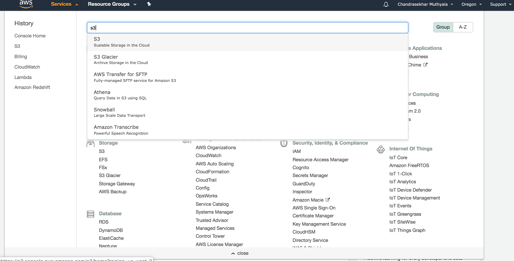
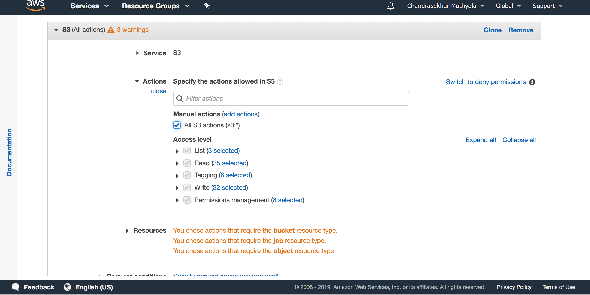

# file-upload-to-s3-save-in-redshift

## Setting up AWS-S3 Bucket

1. Login to [AWS console](https://aws.amazon.com). Click Services and select **S3** .

    <p align="center">
        
    </p>

2. Click **Create Bucket** and follow screenshots as shown below.
    <p align="center">
        
    </p>
    <p align="center">
        
    </p>
    <p align="center">
        
    </p>
    <p align="center">
        
    </p>
    <p align="center">
        
    </p>
    
3. Select the created bucket in the bucket list.
    
    <p align="center">
        
    </p>
    
4. Click **Permissions**
    
    **Bucket Policy**  as shown in the figure below. 
     
     Copy the below Json into Bucket Policy.
     
     ```json
     {
        "Version": "2012-10-17",
        "Id": "Policy1488494182833",
        "Statement": [
            {
                "Sid": "Stmt1488493308547",
                "Effect": "Allow",
                "Principal": {
                    "AWS": "arn:aws:iam::022331431550:user/salesboomerang-user"
                },
                "Action": [
                    "s3:ListBucket",
                    "s3:ListBucketVersions",
                    "s3:GetBucketLocation",
                    "s3:Get*",
                    "s3:Put*"
                ],
                "Resource": "arn:aws:s3:::samplebucket-001"
            }
        ]
    }
    ```
      <p align="center">
          
      </p>
    
      
    
    **CORS Configuration**  as shown in the figure below.
    
    Copy the below Json into CORS Configuration.
    
    ```xml
    <?xml version="1.0" encoding="UTF-8"?>
    <CORSConfiguration xmlns="http://s3.amazonaws.com/doc/2006-03-01/">
    <CORSRule>
        <AllowedOrigin>*</AllowedOrigin>
        <AllowedMethod>GET</AllowedMethod>
        <AllowedMethod>POST</AllowedMethod>
        <AllowedMethod>PUT</AllowedMethod>
        <MaxAgeSeconds>3000</MaxAgeSeconds>
        <AllowedHeader>Authorization</AllowedHeader>
    </CORSRule>
    </CORSConfiguration>
    ```

      <p align="center">
          
      </p>
   
## Setting up AWS-S3 Bucket

1. Now click Services then go to **IAM** services.

  <p align="center">
    
  </p>
  
2. Now on the left side click **Users**

   <p align="center">
        
  </p>
  
3. Now click **Add user**  and follow the below steps to create a user.

    <p align="center">
        
    </p>

    <p align="center">
        
    </p>
    
    <p align="center">
        
    </p>
    
    <p align="center">
        
    </p>
    <p align="center">
        
    </p>
    <p align="center">
        
    </p>
    <p align="center">
        
    </p>
    <p align="center">
        
    </p>
    <p align="center">
        
    </p>
    <p align="center">
        
    </p>
    <p align="center">
        
    </p>
    <p align="center">
        
    </p>
    <p align="center">
        
    </p>
    <p align="center">
        
    </p>
    <p align="center">
        
    </p>
    <p align="center">
        
    </p>
    <p align="center">
        
    </p>
    <p align="center">
        
    </p>
    <p align="center">
        
    </p>
